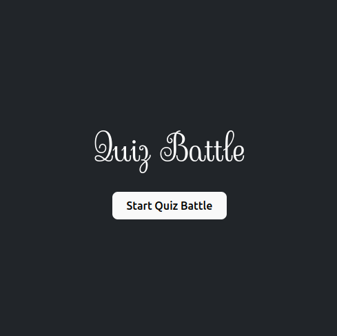

# 🧠 Quiz  Battle

Welcome to **Quiz Battle**, an interactive quiz application built with React! This app challenges your knowledge across three exciting categories: Mathematics, History, and Sport. Get ready to test your brainpower and have fun!

## 🕹️ Get Started
Jump right into the fun! 🎉 Click the button below to start your Quiz Battle adventure and put your knowledge to the test! <br>
[](https://quiz-2jyo.onrender.com/)


## 🌟 Features
- **Three Quiz Categories**: Choose from Mathematics, History, and Sport!
- **Multiple-Choice Questions**: Answer questions and get instant feedback.
- **Score Tracking**: Keep tabs on your performance as you play.
- **Responsive Design**: Works great on both desktop and mobile devices!

## 🛠️ Tech Stack
- **React**: For building a responsive and interactive user interface.
- **JavaScript (ES6+)**: Utilizing modern JavaScript features for cleaner, more efficient code.
- **CSS**: Custom styling to enhance the user experience and make the quiz visually appealing.
- **Render**: Deployed effortlessly on Render for fast, reliable access to your quiz app.

  ## 🚀 How To Run Locally
To get started with Quiz Battle, follow these simple steps:

1. **Clone the Repository**:  
   ```bash
   git clone https://github.com/yourusername/quiz-quest.git
   
2. **Navigate to the Project Directory:**
    ```bash
    cd QuizBattle

3. **Install Dependencies:**
   ```bash
   npm install
   
4. **Start the Development Server:**
   ```bash
    npm run dev

### 🙏 Acknowledgments
A huge thank you to all the question creators and resources that made this project possible. If you see any content that requires attribution, please let me know!

### 📬 Contact
If you have any questions, suggestions, or just want to chat about quizzes, feel free to reach out!

Name: Urooj 👩‍💻
LinkedIn: https://www.linkedin.com/in/urooj-sharif-367686130/

